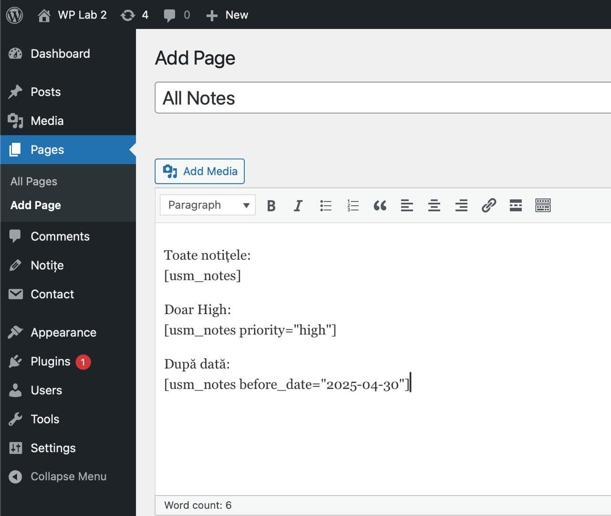
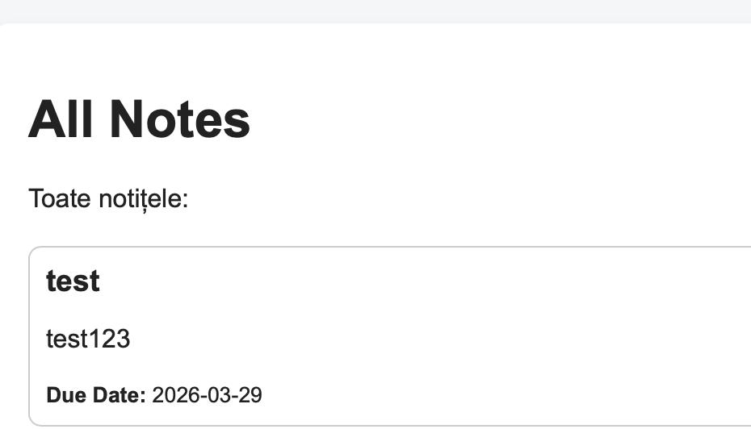

# 📚 USM Notes Plugin

Plugin WordPress pentru gestionarea notițelor studenților.

---

## 🚀 Instrucțiuni pentru rularea proiectului

### 1. Copierea pluginului

Se copiază folderul pluginului în directorul:
wp-content/plugins/
### 2. Activarea pluginului

- Accesează WordPress Admin
- Mergi la Plugins
- Activează **USM Notes Plugin**

---

## 📸 Exemple

---

## ⚙️ Funcționalități

- Adăugare notițe
- Salvare date
- Interfață simplă

---

## 👤 Autor

Denis Lupu